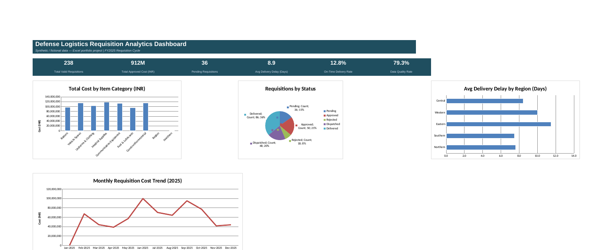
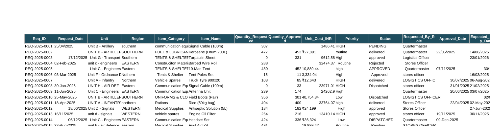
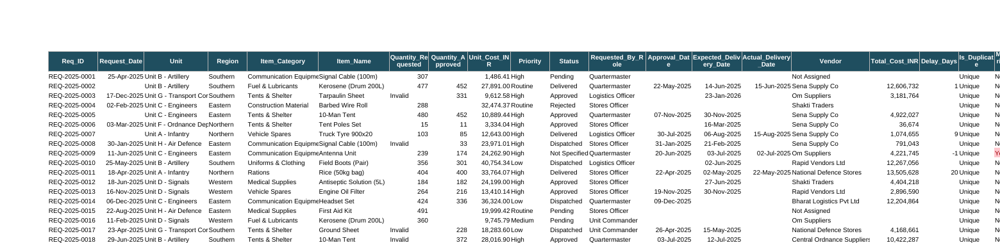
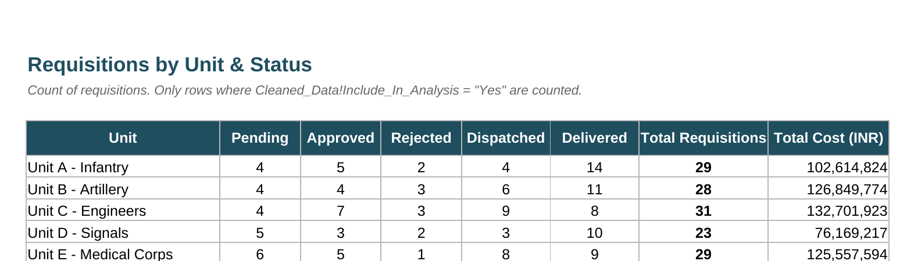

# Defense Logistics Requisition & Inventory Analytics (Excel)

An end-to-end Excel project: messy raw data → cleaning → validation → pivot analysis → dashboard. Built this to actually show the Excel/data-analyst skills I've been learning instead of just listing them on a resume.

** Note:** all data here is synthetic — I generated it myself with randomized values. It's _not_ real defense/army data, doesn't represent any actual unit, vendor, or procurement record. I just used a requisition-tracking scenario because it's close to the kind of analyst work I'm targeting, and it's more interesting than yet another "sample sales data" template.

## Why I built it this way

Most "Excel portfolio projects" I found online start from a dataset that's already clean, which kind of defeats the point — in a real job, nobody hands you clean data. So I wrote a script to generate 300 requisition records with the actual mess you'd get from a real export: dates in three different formats, costs stored as text with ₹ symbols, typos, inconsistent capitalization, duplicate entries, missing fields, and a few rows where the numbers just don't logically add up (approved quantity higher than requested, that kind of thing).

Then I cleaned it the way you'd actually have to — in Excel, with formulas, not by hand-editing values.

## What's in the workbook

| Sheet                                                             | What it does                                                                                                                                                                                                                                                                         |
| ----------------------------------------------------------------- | ------------------------------------------------------------------------------------------------------------------------------------------------------------------------------------------------------------------------------------------------------------------------------------ |
| `Raw_Data`                                                        | The original messy export. 300 rows, untouched.                                                                                                                                                                                                                                      |
| `Lookup_Tables`                                                   | Messy-value → correct-value maps (INDEX/MATCH), used to fix actual typos, not just casing.                                                                                                                                                                                           |
| `Cleaned_Data`                                                    | The cleaning pipeline. Every column is a formula, so if you edit `Raw_Data` the whole thing recalculates. Includes 4 audit columns — duplicate flag, missing-data flag, logic-error flag, and a final `Include_In_Analysis` gate that keeps bad rows out of every number downstream. |
| `Data_Cleaning_Log`                                               | Documents every issue I found and how I fixed it, with a live formula count for each so it's not just a static writeup.                                                                                                                                                              |
| `New_Entry_Form`                                                  | A data-entry template with dropdown validation and range checks — so new records can't reintroduce the same mess.                                                                                                                                                                    |
| `Pivot_Unit_Status`, `Pivot_Category_Month`, `Pivot_Region_Delay` | Cross-tab summaries built with SUMIFS/COUNTIFS/AVERAGEIFS.                                                                                                                                                                                                                           |
| `Dashboard`                                                       | KPIs + 4 charts, all pulling live off `Cleaned_Data`.                                                                                                                                                                                                                                |

## Screenshots

**Dashboard**

**Before — raw data as exported**

**After — cleaned, standardized, with audit flags**

**Pivot-style summary (Unit × Status)**

## What the data actually says

- **238 of 300 requisitions (79.3%)** passed all data-quality checks — the rest had duplicates, missing fields, or logic errors and were excluded from analysis rather than silently included
- **₹91.2 crore** in total approved cost across valid requisitions
- **Only 12.8% of deliveries arrived on time** — average delay was 8.9 days, worst in the Eastern region (11.5 days)
- Unit H (Air Defence) raised the most requisitions overall

That third point is the one I'd actually lead with in an interview — it's a real finding, not just a chart for the sake of having one.

## The cleaning problems I dealt with (and how)

- **Dates in 3 formats** — real Excel dates, `DD/MM/YYYY` text, and `DD-Mon-YYYY` text, mixed in the same column. This one actually bit me: `DATEVALUE()` alone silently misreads `DD/MM/YYYY` under a US-locale setup (swaps day and month whenever the day is ≤12, which fails silently instead of throwing an error). Ended up parsing the slash-format dates manually with `DATE(RIGHT(...), MID(...), LEFT(...))` instead of trusting `DATEVALUE` blindly.
- **Currency as text** — values like `₹27,891` needed `SUBSTITUTE()` to strip the symbol and commas before `VALUE()` could touch them.
- **Typos vs. casing** — casing/whitespace issues (`"unit b - artillery"`) I handled with `TRIM()`/`PROPER()`. Actual misspellings (`"Raitons"` instead of `"Rations"`) needed a real lookup table and `INDEX`/`MATCH`, since a formula can't guess what you meant to type.
- **Duplicates** — a running `COUNTIF($A$2:A2, A2)` flags the second+ occurrence of a Req_ID without needing to delete rows or break formula continuity.
- **Logic errors** — quantity approved exceeding quantity requested, or an approved quantity sitting on a rejected requisition. Cross-field checks, not just single-cell validation.

## How to use it

Everything past `Raw_Data` is a live formula — nothing is pasted as a static value. To see it work: change something in `Raw_Data`, open in Excel, hit `Ctrl+Alt+F9` (force full recalculate), and watch `Cleaned_Data`, the pivots, the cleaning log counts, and the dashboard all update together.

## Built with

Excel — `SUMIFS`, `COUNTIFS`, `AVERAGEIFS`, `INDEX`/`MATCH`, `IFERROR`, Data Validation, PivotCharts.

## What I'd add next

Native Excel PivotTables on top of the cleaned data (the summaries here are formula-driven cross-tabs, which do the same job but I want the native ones in there too), and a Power BI version of the same dataset for comparison.

---

Built by [Shiv Salunke](https://github.com/Shiv-x0) — 2nd year CS undergrad, learning data analytics for a Data Analyst Intern role. Feedback welcome.
